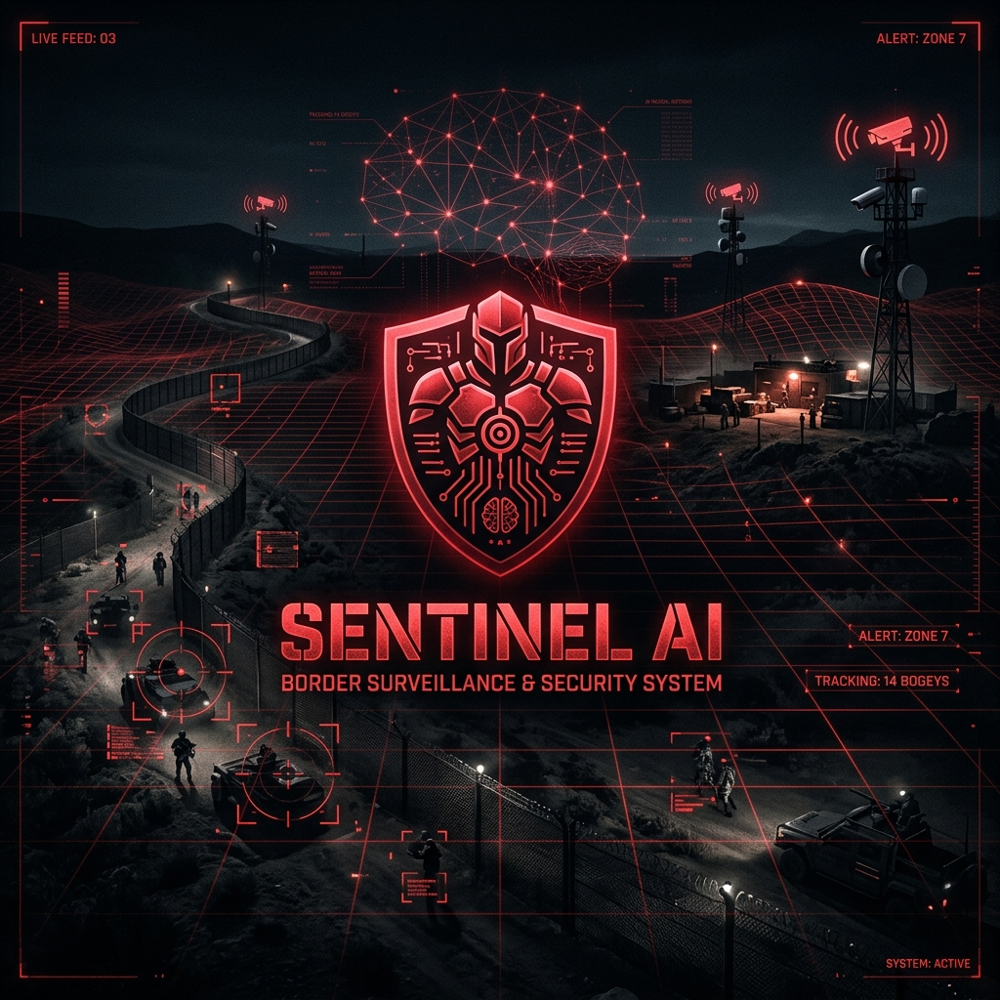

<p align="center">
  
</p>

<h1 align="center">🛡️ SentinelAI — Border Surveillance System</h1>

<p align="center">
  <strong>Real-time AI-powered border surveillance with YOLOv8 object detection, multi-zone threat classification, and a tactical React dashboard.</strong>
</p>

<p align="center">
  
  
  
  
  
  
</p>

---

## 📋 Table of Contents

- [Overview](#-overview)
- [Features](#-features)
- [Architecture](#-architecture)
- [Tech Stack](#-tech-stack)
- [Project Structure](#-project-structure)
- [Prerequisites](#-prerequisites)
- [Installation & Setup](#-installation--setup)
- [Usage Guide](#-usage-guide)
- [Mobile Access](#-mobile-access)
- [API Reference](#-api-reference)
- [Configuration](#-configuration)
- [Team](#-team)
- [License](#-license)

---

## 🔍 Overview

**SentinelAI** is an intelligent border surveillance system that combines **YOLOv8 deep learning models** with a **real-time tactical dashboard** to provide comprehensive perimeter monitoring. The system processes video feeds (local files or live YouTube streams), detects and tracks persons and vehicles, classifies threat levels across user-defined restricted zones, and delivers instant alerts through both desktop and mobile interfaces.

Built for **hackathons, defense prototyping, and smart city surveillance**, SentinelAI demonstrates how modern AI can be applied to critical infrastructure protection.

---

## ✨ Features

### 🎯 AI Detection Engine
| Feature | Description |
|---------|-------------|
| **Object Detection** | YOLOv8-powered detection of persons, vehicles (cars, motorcycles, buses, trucks) |
| **Multi-Object Tracking** | Persistent ID tracking across frames with direction arrows |
| **Restricted Zones** | Draw custom polygon zones on the video feed in real-time |
| **Tripwire Crossing** | Define virtual lines and get alerts when objects cross them |
| **Loitering Detection** | Flags persons lingering in restricted zones beyond a threshold |
| **Crowd Surge Detection** | Detects sudden increases in person count over a sliding window |
| **Suspicious Movement** | Zigzag/erratic path detection with visual trail rendering |
| **Night Mode** | Automatic low-light detection with adjusted threat scoring |
| **Threat Classification** | Multi-factor threat level (LOW → MEDIUM → HIGH) per zone |

### 🖥️ Tactical Dashboard (Desktop)
- **Cinematic landing page** with particle animations, typewriter effects, and parallax scrolling
- **Real-time video feed** with zone overlays, bounding boxes, and path trails
- **Live statistics** — persons, vehicles, zones, and alert counts
- **Activity graphs** — real-time, 1-minute, and 5-minute aggregated views (Recharts)
- **Zone management** — draw zones and tripwires directly on the feed
- **Module toggles** — enable/disable loitering, night, and surge detection
- **Alert log** — scrollable event history with fade-out effect

### 📱 Mobile Command Unit
- **iOS-inspired native design** with smooth animations and haptic feedback
- **Push-style toast notifications** with audio alerts for critical events
- **Threat badge, live counts, zone status** — all in real-time via WebSocket
- **Activity graph** with multi-timeframe tabs
- **Module toggles and source switching** — full remote control
- **Add-to-homescreen** support for app-like experience

---

## 🏗️ Architecture

```
┌──────────────────────────────────────────────────────────────┐
│                        CLIENT LAYER                          │
│  ┌──────────────────┐         ┌──────────────────────────┐   │
│  │  React Dashboard │         │  Mobile HTML Interface   │   │
│  │  (Desktop)       │◄──WS──►│  (Phone/Tablet)          │   │
│  └────────┬─────────┘         └───────────┬──────────────┘   │
│           │                               │                  │
│       WebSocket                       WebSocket              │
│       + REST API                      + REST API             │
└───────────┼───────────────────────────────┼──────────────────┘
            │                               │
┌───────────▼───────────────────────────────▼──────────────────┐
│                      SERVER LAYER                            │
│  ┌──────────────────────────────────────────────────────┐    │
│  │              FastAPI + WebSocket Server               │    │
│  │         (server.py — port 8000)                       │    │
│  │  • REST endpoints for zones, tripwires, modes         │    │
│  │  • WebSocket broadcast of shared_state                │    │
│  │  • Static file serving (React build + mobile.html)    │    │
│  └────────────────────────┬─────────────────────────────┘    │
│                           │ shared_state dict                │
│  ┌────────────────────────▼─────────────────────────────┐    │
│  │              Detection Engine (detect.py)             │    │
│  │  • YOLOv8 inference + multi-object tracking           │    │
│  │  • Zone/Tripwire logic, loitering, surge, zigzag      │    │
│  │  • Frame encoding + push to shared_state              │    │
│  └────────────────────────┬─────────────────────────────┘    │
│                           │                                  │
│  ┌────────────────────────▼─────────────────────────────┐    │
│  │            Video Source (local .mp4 / YouTube)        │    │
│  └──────────────────────────────────────────────────────┘    │
└──────────────────────────────────────────────────────────────┘
```

---

## 🛠️ Tech Stack

| Layer | Technology |
|-------|-----------|
| **AI/ML** | YOLOv8 (Ultralytics), OpenCV, NumPy |
| **Backend** | Python 3.10+, FastAPI, Uvicorn, WebSocket |
| **Frontend (Desktop)** | React 19, Recharts, Custom CSS-in-JS |
| **Frontend (Mobile)** | Vanilla HTML/CSS/JS (iOS-inspired design) |
| **Streaming** | yt-dlp (optional, for YouTube live feeds) |

---

## 📁 Project Structure

```
SentinelAI/
├── README.md                          # This file
├── .gitignore                         # Git ignore rules
├── assets/
│   └── banner.png                     # README banner image
│
├── border survailance/                # Backend — Python detection engine
│   ├── run.py                         # 🚀 Main entry point — starts everything
│   ├── server.py                      # FastAPI server + WebSocket broadcaster
│   ├── detect.py                      # YOLOv8 detection engine + all AI logic
│   ├── mobile.html                    # Mobile surveillance interface
│   ├── yolov8n.pt                     # YOLOv8 Nano model  (6.5 MB)  ⚡ Fastest
│   ├── yolov8m.pt                     # YOLOv8 Medium model (52 MB)  ⚖️ Balanced
│   ├── yolov8l.pt                     # YOLOv8 Large model  (88 MB)  🎯 Accurate
│   ├── test.mp4                       # Sample test video
│   ├── static/                        # Auto-generated React build (served by FastAPI)
│   └── test logs/                     # Historical alert logs
│
└── surveillance-dashboard/            # Frontend — React dashboard
    ├── package.json
    ├── public/
    └── src/
        ├── App.js                     # Full dashboard + landing page (1235 lines)
        ├── App.css
        └── index.js
```

---

## 📦 Prerequisites

Make sure you have the following installed:

| Requirement | Version | Check Command |
|-------------|---------|---------------|
| **Python** | 3.10 or higher | `python --version` |
| **pip** | Latest | `pip --version` |
| **Node.js** | 18+ (for building dashboard) | `node --version` |
| **npm** | 9+ | `npm --version` |
| **Git** | Any | `git --version` |

> **GPU (Optional):** For real-time performance, an NVIDIA GPU with CUDA support is recommended. The system works on CPU but at lower FPS.

---

## 🚀 Installation & Setup

### 1️⃣ Clone the Repository

```bash
git clone https://github.com/AddyKali/SentinelAI.git
cd SentinelAI
```

### 2️⃣ Install Python Dependencies

```bash
pip install ultralytics opencv-python numpy fastapi uvicorn pydantic
```

**Optional** (for YouTube live stream support):
```bash
pip install yt-dlp
```

### 3️⃣ Download YOLOv8 Model Weights

The detection engine uses YOLOv8 models. If not already present, they auto-download on first run. To manually download:

```bash
cd "border survailance"
python -c "from ultralytics import YOLO; YOLO('yolov8m.pt')"
```

| Model | Size | Speed | Accuracy | Use Case |
|-------|------|-------|----------|----------|
| `yolov8n.pt` | 6.5 MB | ⚡ Fastest | Good | Low-power devices |
| `yolov8m.pt` | 52 MB | ⚖️ Balanced | Better | **Recommended** |
| `yolov8l.pt` | 88 MB | 🐢 Slower | Best | High-accuracy needs |

> To change the model, edit `detect.py` line 67: `model = YOLO('yolov8m.pt')`

### 4️⃣ Build the React Dashboard

```bash
cd surveillance-dashboard
npm install
npm run build
cd ..
```

This creates a `build/` folder that gets automatically copied to `border survailance/static/` when you run the system.

### 5️⃣ Add a Test Video (Optional)

Place any `.mp4` video file in the `border survailance/` folder and rename it to `test.mp4`, or update the `VIDEO_FILE` variable in `detect.py`.

---

## ▶️ Running SentinelAI

### Quick Start (One Command)

```bash
cd "border survailance"
python run.py
```

This will:
1. ✅ Copy the React build to the `static/` folder
2. ✅ Start the FastAPI server on `http://localhost:8000`
3. ✅ Open your browser automatically
4. ✅ Start the YOLOv8 detection engine
5. ✅ Display mobile access URL for your phone

### What You'll See

```
══════════════════════════════════════════════════════
  SENTINEL BORDER SURVEILLANCE SYSTEM
══════════════════════════════════════════════════════
  Desktop  : http://localhost:8000
  Mobile   : http://192.168.x.x:8000/mobile
══════════════════════════════════════════════════════
```

---

## 📖 Usage Guide

### Step 1: Landing Page
When you first open the dashboard, you'll see a cinematic landing page. Click **"LAUNCH DETECTION SYSTEM"** to enter the surveillance dashboard.

### Step 2: Draw Restricted Zones
On the dashboard, the video feed shows the first frame. Click points on the video to draw polygon zones:
- **ZONE mode**: Click 3+ points → Click **SAVE ZONE** to create a restricted area
- **WIRE mode**: Click 2 points → Click **SAVE WIRE** to create a tripwire line
- Create multiple zones and wires as needed

### Step 3: Start Detection
Click the red **INITIATE** button to begin AI detection. The system will:
- Detect and track all persons and vehicles
- Color-code bounding boxes based on threat level
- Show direction arrows and movement trails
- Generate alerts for zone entries, tripwire crossings, loitering, and suspicious movement

### Step 4: Monitor & Control
- **Toggle modules** (Loitering/Night/Surge) using the sidebar switches
- **View activity graphs** in real-time, 1-min, or 5-min aggregated views
- **Track threat levels** per zone (LOW → MEDIUM → HIGH)
- **Review alert log** for all events with timestamps

### Step 5: Stop/Restart
Click **HALT** to stop detection and return to zone setup mode.

---

## 📱 Mobile Access

Access the mobile command interface from any device on the same WiFi network:

1. Connect your phone to the **same WiFi** as the computer running SentinelAI
2. Open your phone browser and go to: `http://<your-local-ip>:8000/mobile`
3. Tap **"AUTHORIZE SYSTEM LINK"** to enable audio alerts and real-time updates
4. **Add to home screen** for a native app-like experience

### Mobile Features
- 🔴 Real-time threat level display
- 📊 Live person/vehicle/zone/alert counts
- ⚡ Crowd surge indicator
- 🔔 Push-style toast notifications with sound & vibration
- 📈 Activity graphs (Realtime / 1 Min / 5 Min)
- ⚙️ Module toggles and source switching

---

## 🔌 API Reference

The FastAPI server exposes these endpoints:

| Method | Endpoint | Description | Body |
|--------|----------|-------------|------|
| `POST` | `/add_zone` | Add a restricted zone | `{ "name": "SECTOR-A", "points": [[x,y], ...] }` |
| `POST` | `/add_tripwire` | Add a tripwire line | `{ "name": "WIRE-1", "p1": [x,y], "p2": [x,y] }` |
| `POST` | `/start_detection` | Begin AI detection | — |
| `POST` | `/stop_detection` | Stop detection | — |
| `POST` | `/set_mode` | Toggle detection module | `{ "mode": "loitering", "value": true }` |
| `WS` | `/ws` | WebSocket real-time stream | Broadcasts `shared_state` JSON |
| `GET` | `/` | Serve React dashboard | — |
| `GET` | `/mobile` | Serve mobile interface | — |

### WebSocket Data Format

```json
{
  "frame": "<base64-encoded-jpeg>",
  "alerts": [{ "time": "14:30:05", "msg": "Person crossed WIRE-1!" }],
  "zones": [{ "name": "SECTOR-A", "threat": "HIGH", "persons": 3, "vehicles": 1 }],
  "total_persons": 5,
  "total_vehicles": 2,
  "night": false,
  "surge": true,
  "modes": { "loitering": true, "night": true, "surge": true },
  "setup_done": true
}
```

---

## ⚙️ Configuration

Key configuration variables in `detect.py`:

```python
VIDEO_FILE  = 'test.mp4'                    # Default video source
LIVE_URL    = "https://youtube.com/..."      # YouTube live stream URL
DETECT_EVERY_N_FRAMES = 2                   # YOLO inference frequency (↑ = faster, less smooth)
PUSH_EVERY_N_FRAMES   = 3                   # Dashboard update frequency
LOITER_SECONDS        = 5                   # Time before loitering alert
SURGE_WINDOW          = 90                  # Frames for surge detection window
SURGE_THRESHOLD       = 5                   # Person count increase threshold
PATH_HISTORY_LEN      = 20                  # Tracking points for zigzag detection
ZIGZAG_THRESHOLD      = 4                   # Direction changes to flag suspicious
```

### Switching Video Source at Runtime
- Type `l` + Enter in the terminal → Switch to **live YouTube stream**
- Type `v` + Enter in the terminal → Switch to **local video file**

---

## 🧪 Threat Scoring Algorithm

Threat levels are computed per-zone using a multi-factor scoring model:

| Factor | Score |
|--------|-------|
| 10+ persons or 5+ vehicles | +3 |
| 3+ persons or 2+ vehicles | +1 |
| Loiterer detected in zone | +2 |
| Night mode active | +1 |
| Crowd surge detected | +2 |

| Total Score | Threat Level |
|-------------|-------------|
| 0–1 | 🟢 **LOW** |
| 2–3 | 🟠 **MEDIUM** |
| 4+ | 🔴 **HIGH** |

---

## 👥 Team

**Team Boomer** — Built for hackathon excellence.

---

## 📄 License

This project is licensed under the **MIT License** — see the [LICENSE](LICENSE) file for details.

---

<p align="center">
  <strong>⚡ Built with AI. Secured by SENTINEL. ⚡</strong>
</p>
